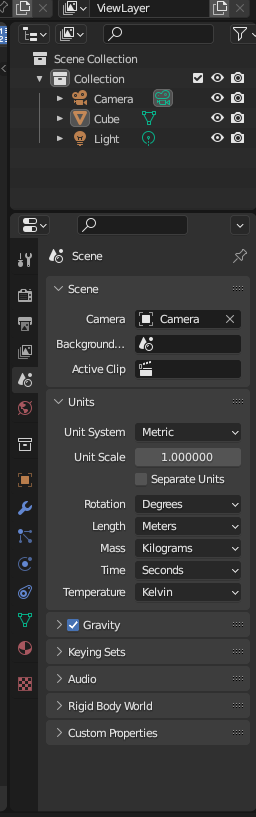

# **Table of content:**
1. [Create Tank](#create-tank)
1. [Display Tank Statistics](#display-tank-statistics)
1. [Store tank in cargo manifest](#store-tank-in-cargo-manifest)
1. [Blender Settings](#blender-settings)

## Create Tank
##### User Inputs:
- Dimensions (int)
- Liquid Type: Oil,Water & Fuel 
- Shift Priority (int)
- Current Level (%) (int)
- Thickness (int)
- Material type: Plastic, Steel & Aluminum (Enum)

#### Methods:
- `weight()`
- `volume()`
- `moment()`
- `unique_name()`
- `current_capacity()`

## Display tank statistics
## Store tank in cargo manifest
## Blender Settings
  
